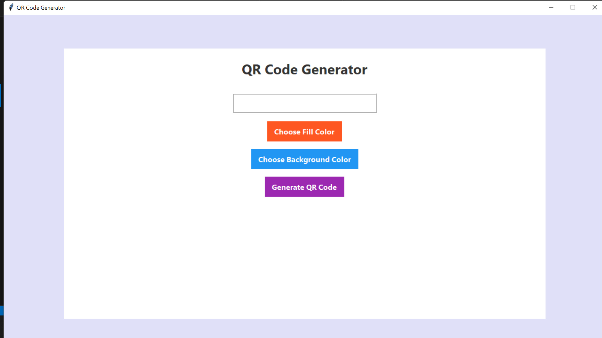

# QR Code Generator  
 

A sleek and modern **QR code generator** built with Python and Tkinter. Generate QR codes for any URL, customize colors, preview them, and save as PNG — all in a stylish, web-like GUI.

---

## ✨ Features
- Enter any URL to generate a QR code  
- Choose **fill color** and **background color**  
- Preview QR code instantly  
- Save QR code as a **PNG image**  
- Modern, web-like interface with rounded buttons and subtle shadows  

---

## 📸 Screenshot


---

## ⚙️ Installation

1. **Clone the repository**
   ```bash
   git clone https://github.com/22A31A42E5/QR-Code-Generator.git
   cd QR-Code-Generator
   ```

2. **Create a virtual environment** (optional but recommended)  
   ```bash
   python -m venv venv
   ```

   - On macOS/Linux:
     ```bash
     source venv/bin/activate
     ```
   - On Windows:
     ```bash
     venv\Scripts\activate
     ```

3. **Install the required dependencies**
   ```bash
   pip install qrcode pillow
   ```

---

## ▶️ Usage

Run the Python script:
```bash
python qr_code.py
```

1. Enter the URL you want to generate a QR code for  
2. Pick **fill color** and **background color**  
3. Click **Generate QR Code** to preview it instantly  
4. Save your QR code by clicking the **Save** button  

Your QR code will be saved as a **PNG image** 🎉

---

## 🛠️ How It Works
- **qrcode** → generates QR codes  
- **Pillow (PIL)** → image handling & color customization  
- **Tkinter** → modern GUI with buttons, input fields & preview functionality  

---

## 📦 Requirements
- Python **3.8 or higher**  
- Libraries: `qrcode`, `Pillow`, `Tkinter` (usually comes pre-installed with Python)  

---

## 🤝 Contributing
Contributions are welcome!  

1. Fork the repository  
2. Create a new branch:  
   ```bash
   git checkout -b feature-name
   ```
3. Make your changes and commit:  
   ```bash
   git commit -m "Add new feature"
   ```
4. Push to your fork:  
   ```bash
   git push origin feature-name
   ```
5. Open a **Pull Request** 🎯

---

## 📄 License
This project is licensed under the **MIT License**.  
See [LICENSE](LICENSE) for details.
